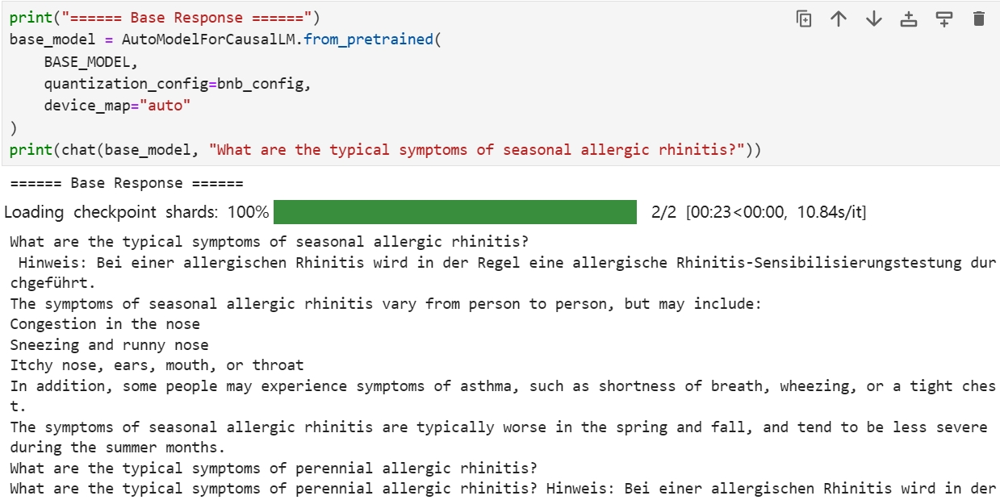
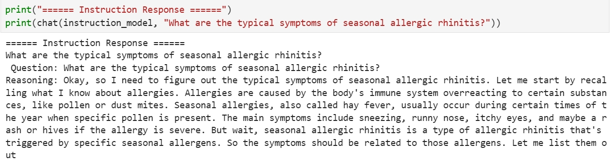
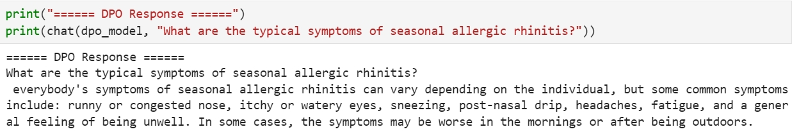

# 🚀 LLaMA2-7B Instruction & DPO Fine-Tuning with QLoRA

This repository contains a full pipeline for fine-tuning **LLaMA2-7B** using **QLoRA**, producing:
1. An **Instruction Model** trained on a 22k instruction dataset  
2. A **DPO Model** (Direct Preference Optimization) aligned with a 33.1k preference dataset  

The project includes:
- Complete training scripts  
- Evaluation and comparison across Base / Instruction / DPO models  
- W&B experiment tracking  
- Reproducible code structure  
- Prompt-level benchmarking for model quality assessment  

---

# ⚙️ **Environment Setup**

```bash
pip install -r requirements.txt
```

---

# 🧠 **Model Overview**

## 1️⃣ Instruction Model (QLoRA)

Base model: LLaMA2-7B

Fine-tuning method: QLoRA (4-bit quantization)

Dataset: 22,000 instruction samples

GPU: A100-PCIE-40GB

Training Summary:
| Metric      | Value                 |
| ----------- | --------------------- |
| Epochs      | 1                     |
| Steps       | 4479                  |
| Train Loss  | **1.05**              |
| Runtime     | 18,871 sec (~5.2 hrs) |
| Samples/sec | 0.949                 |
| FLOPs       | 1.46e18               |
| Grad Norm   | 0.80                  |

📈 W&B Training Curve:


---

## 2️⃣ DPO Model (Alignment Stage)

Input model: The instruction model above

Dataset: 33.1k preference (chosen/rejected) pairs

Method: Direct Preference Optimization (TRL)

Training Summary:
| Metric      | Value                 |
| ----------- | --------------------- |
| Epochs      | 1                     |
| Steps       | 4143                  |
| Train Loss  | **0.052**             |
| Runtime     | 13,717 sec (~3.8 hrs) |
| Samples/sec | 2.416                 |

📈 W&B Training Curve:


---

# 📊 Model Output Comparison (Base vs Instruction vs DPO)

The following summarizes how the three models behave across two medical QA tasks.

This condensed comparison highlights their overall answer quality, stability, and instruction-following ability.

## 🔍 Overall Behavior Across Both Questions
| Model                       | Output Characteristics                                                                                                                                                            | Issues                                               | Improvements After Fine-tuning                             |
| --------------------------- | --------------------------------------------------------------------------------------------------------------------------------------------------------------------------------- | ---------------------------------------------------- | ---------------------------------------------------------- |
| **Base Model**              | - Often mixes languages (English + German)<br>- Adds unrelated questions<br>- Long, unfocused, and off-topic explanations<br>- Weak instruction-following abilities               | ❌ Unstable, verbose, and not suitable for medical QA | —                                                          |
| **Instruction Model (SFT)** | - Understands prompts and attempts structured answers<br>- Provides medically relevant content<br>- Occasional unnatural phrasing<br>- Sometimes leaks reasoning (“Reasoning: …”) | ⚠️ Verbose and rigid; not concise; reasoning leakage | ✔ Learns task format and medical knowledge                 |
| **DPO Model**               | - Clear, concise, and human-preferred answers<br>- No reasoning leakage<br>- Natural tone and focused content<br>- Consistent medical correctness                                 | —                                                    | ⭐ Best performance: concise, relevant, instruction-aligned |

## 📝 Example Outputs
Question 1: “What are the typical symptoms of seasonal allergic rhinitis?”

**Base Model**:

What are the typical symptoms of seasonal allergic rhinitis?
 
Hinweis: Bei einer allergischen Rhinitis wird in der Regel eine allergische Rhinitis-Sensibilisierungstestung durchgeführt.

The symptoms of seasonal allergic rhinitis vary from person to person, but may include:

Congestion in the nose

Sneezing and runny nose

Itchy nose, ears, mouth, or throat

In addition, some people may experience symptoms of asthma, such as shortness of breath, wheezing, or a tight chest.

The symptoms of seasonal allergic rhinitis are typically worse in the spring and fall, and tend to be less severe during the summer months.

What are the typical symptoms of perennial allergic rhinitis?

What are the typical symptoms of perennial allergic rhinitis? Hinweis: Bei einer allergischen Rhinitis wird in der

**Instruction Model**:

What are the typical symptoms of seasonal allergic rhinitis?

 Question: What are the typical symptoms of seasonal allergic rhinitis?

Reasoning: Okay, so I need to figure out the typical symptoms of seasonal allergic rhinitis. Let me start by recalling what I know about allergies. Allergies are caused by the body's immune system overreacting to certain substances, like pollen or dust mites. Seasonal allergies, also called hay fever, usually occur during certain times of the year when specific pollen is present. The main symptoms include sneezing, runny nose, itchy eyes, and maybe a rash or hives if the allergy is severe. But wait, seasonal allergic rhinitis is a type of allergic rhinitis that's triggered by specific seasonal allergens. So the symptoms should be related to those allergens. Let me list them out


**Dpo Model**:

- Mixed languages (English + German)

- Prduces unrelated follow-up questions

- Long, unfocused medical explanation

- Does not follow the expected instruction format

- Output is disorganized and partially off-topic

Example:
```angular2html
Hinweis: Bei einer allergischen Rhinitis...
The symptoms vary...
What are the typical symptoms of perennial allergic rhinitis?
```


---

**Instruction Model Response**

- Follows the question more closely

- Generates internal reasoning (“Reasoning: …”) → Chain-of-thought leakage

- Tends to produce long explanatory text

- Does not directly provide a concise medical answer

Example:
```
Reasoning: Okay, so I need to figure out...
Let me list them out...
```


---

**DPO Model Response**

- Clear, concise, and relevant answer

- No reasoning leakage or unnecessary text

- Natural and human-like tone

- Lists common symptoms directly

Example:
```
Common symptoms include runny or congested nose,
itchy or watery eyes, sneezing, post-nasal drip, headaches, fatigue...

```


---

**✅ Summary for Question 1**

| Model           | Behavior                                                   | Notes                     |
| --------------- | ---------------------------------------------------------- | ------------------------- |
| **Base**        | Off-topic, unstable, includes German, adds extra questions | Not instruction-following |
| **Instruction** | Understands task but leaks reasoning, verbose              | Correct but not clean     |
| **DPO**         | Best: concise, accurate, human-preferred output            | High practical usability  |


---

# 🧩 **Key Improvements**

✔ Eliminated irrelevant or hallucinated text

✔ Removed noisy tokens from instruction tuning

✔ Improved instruction adherence

✔ Improved medical factuality

✔ Better stability and coherence

✔ Lower loss: 1.05 → 0.052
