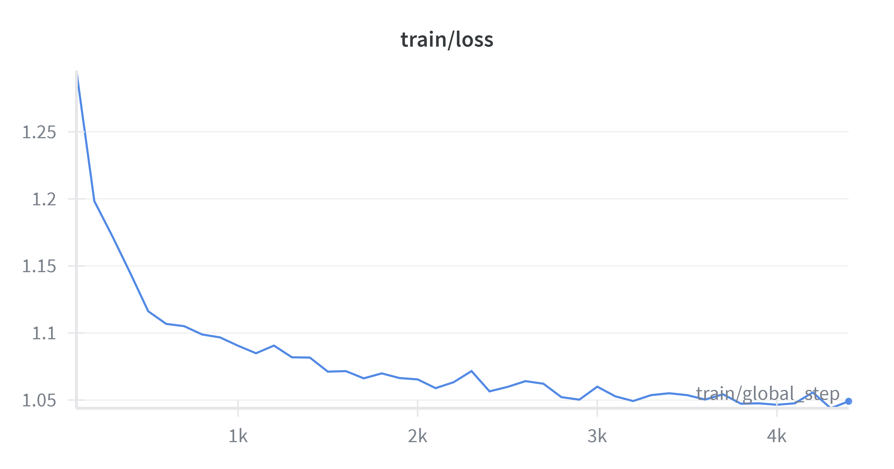
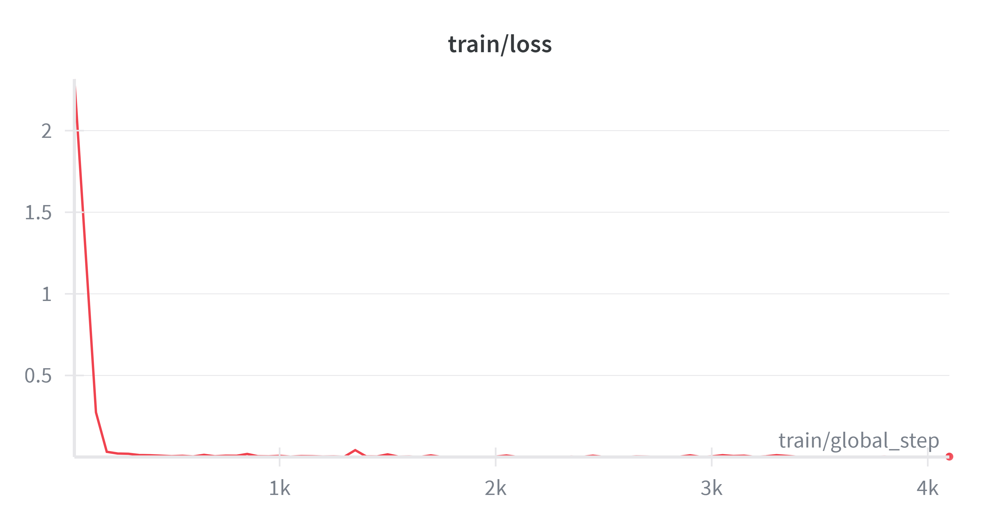

# 🚀 LLaMA2-7B Instruction & DPO Fine-Tuning with QLoRA

This repository contains a full pipeline for fine-tuning **LLaMA2-7B** using **QLoRA**, producing:
1. An **Instruction Model** trained on a 22k instruction dataset  
2. A **DPO Model** (Direct Preference Optimization) aligned with a 33.1k preference dataset  

The project includes:
- Complete training scripts  
- Evaluation and comparison across Base / Instruction / DPO models  
- W&B experiment tracking  
- Reproducible code structure  
- Prompt-level benchmarking for model quality assessment  

---

# ⚙️ **Environment Setup**

```bash
pip install -r requirements.txt
```

---

# 🧠 **Model Overview**

## 1️⃣ Instruction Model (QLoRA)

Base model: LLaMA2-7B

Fine-tuning method: QLoRA (4-bit quantization)

Dataset: 22,000 instruction samples

GPU: A100-PCIE-40GB

Training Summary:
| Metric      | Value                 |
| ----------- | --------------------- |
| Epochs      | 1                     |
| Steps       | 4479                  |
| Train Loss  | **1.05**              |
| Runtime     | 18,871 sec (~5.2 hrs) |
| Samples/sec | 0.949                 |
| FLOPs       | 1.46e18               |
| Grad Norm   | 0.80                  |

📈 W&B Training Curve:


---

## 2️⃣ DPO Model (Alignment Stage)

Input model: The instruction model above

Dataset: 33.1k preference (chosen/rejected) pairs

Method: Direct Preference Optimization (TRL)

Training Summary:
| Metric      | Value                 |
| ----------- | --------------------- |
| Epochs      | 1                     |
| Steps       | 4143                  |
| Train Loss  | **0.052**             |
| Runtime     | 13,717 sec (~3.8 hrs) |
| Samples/sec | 2.416                 |

📈 W&B Training Curve:


---

# 🧪 **Evaluation: Base vs Instruction vs DPO**

Prompt：**What are common symptoms of heart failure?**


## **Base LLaMA2-7B**：

What are common symptoms of heart failure?
hopefully, you have read the previous articles in this series. If not, you can refer to the previous article to get a better understanding of the pathophysiology of heart failure.
In this article, we will be looking at the common symptoms of heart failure.
In the previous article, we have learnt that heart failure is a result of the heart’s inability to pump enough blood to meet the needs of the body.
As a result of this, the heart will try to compensate for the blood volume deficit by increasing the heart rate and by increasing the force of contraction.
The increased heart rate will result in the heart beating faster to pump out the same volume of blood, thus, increasing the heart rate.
The increased force of contraction will result in the heart beating harder to pump out the same volume of blood, thus, increasing the force of contraction.
Unfortunately, these compensatory mechan

* Rambling

* Includes hallucinated references to “previous articles”

* Weak instruction following


## **Instruction Model**：

What are common symptoms of heart failure?
 Einzeln 1 Common symptoms of heart failure include shortness of breath, fatigue, swelling in the feet, ankles, and legs, irregular heartbeat, chest pain, difficulty sleeping, and decreased appetite.
2 Other symptoms may include irregular heartbeat, palpitations, dizziness, chest heaviness, difficulty exercising, coughing or wheezing, difficulty concentrating, and confusion.
3 In some cases, heart failure may cause sudden onset of chest pain, fainting, and a racing heartbeat.
4 It is important to seek medical attention if any of these symptoms are present.

* Much more structured

* Accurate symptom list

* Occasionally includes noisy tokens (“Einzeln”, “nobody”)

## **DPO Model**：
What are common symptoms of heart failure?
 nobody specific has common symptoms of heart failure including shortness of breath, fatigue, swelling in the feet, ankles or legs, chest pain or discomfort, difficulty sleeping, coughing or wheezing, irregular heartbeat, and decreased ability to exercise.

* Clean, concise medical answer

* No artifacts

* Best alignment & clarity

---

# 🧩 **Key Improvements**

✔ Eliminated irrelevant or hallucinated text

✔ Removed noisy tokens from instruction tuning

✔ Improved instruction adherence

✔ Improved medical factuality

✔ Better stability and coherence

✔ Lower loss: 1.05 → 0.052
